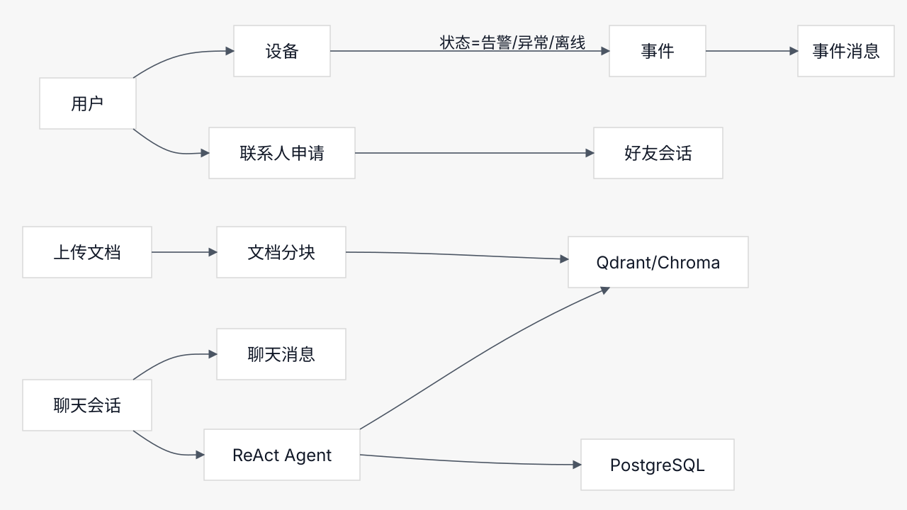

# 后端代码梳理

本文档用于快速重新接手 `fire_ops/app` 后端代码，重点说明目录职责、启动流程、核心数据模型、主要业务链路，以及常见问题的排查入口。

## 技术栈

- Web 框架：FastAPI
- ORM：Tortoise ORM
- 数据库：PostgreSQL
- 缓存和任务队列：Redis
- 异步任务：Celery
- 文档解析：Document Process（DP，`pipeline` / `hybrid`）
- 向量库：Qdrant
- 大模型调用：LangChain OpenAI 兼容接口，默认模型 `deepseek-chat`
- 智能问答：XML ReAct + FastMCP 工具

## 全局关系图



这张图可以先按三条主线理解：

- 设备线：用户维护设备，设备状态异常后产生事件，事件下有事件消息。
- 联系人线：用户发起联系人申请，通过后形成好友会话。
- 问答线：文档上传后进入分块和向量库；聊天会话通过 ReAct Agent 同时查向量库和 PostgreSQL。

## 目录结构

```text
fire_ops/app
├── asgi.py                      # FastAPI 入口，初始化数据库、Redis、初始管理员
├── config.py                    # 全局配置，数据库、Redis、LLM、向量库、OCR、Celery
├── apps
│   ├── __init__.py              # create_app，挂载静态目录、CORS、自动注册路由
│   ├── api                      # HTTP API 路由
│   ├── dependencies             # 登录鉴权、角色权限
│   ├── form                     # 请求表单 / Pydantic 参数定义
│   ├── models                   # Tortoise ORM 模型
│   └── utils                    # 公共工具、RAG、ReAct、MCP、文档处理、Redis、Token
├── celery_tasks
│   ├── app.py                   # Celery 实例
│   └── task.py                  # 文档后台处理任务
├── data                         # 上传文件、头像、设备图片等运行期数据
├── docs                         # 项目说明文档和图示资源
├── models                       # 本地离线模型缓存
├── nltk_data                    # NLTK 离线数据
├── static                       # 后端静态资源
├── README.md
├── pyproject.toml
└── uv.lock
```

## 启动流程

入口文件是 `asgi.py`。

```text
asgi.py
  -> create_app(lifespan=lifespan)
  -> init_static()
  -> init_cors()
  -> init_routes()
  -> lifespan 启动
       -> Tortoise.init()
       -> ensure_initial_admin()
       -> RedisManager.init()
```

关键点：

- `apps/__init__.py` 会自动扫描 `apps/api` 下所有 `.py` 文件。
- 只要模块里存在 `router`，就会自动挂载到 `/api/v1`。
- 根路径 `/` 返回 API 说明；管理端 UI 见独立项目 `fire-admin`。
- `/docs` 和 `/redoc` 使用本地静态 Swagger / ReDoc 资源。

## 配置说明

配置集中在 `config.py`。

主要配置块：

```text
基础配置        DEBUG、BASE_PATH、STATIC_PATH
安全配置        SECRET_KEY、AES_KEY、初始管理员
数据库          POSTGRES_*、DATABASE_URL、TORTOISE_ORM
Redis           REDIS_HOST、REDIS_PORT、REDIS_DB
文档存储        DATA_DIR、DOCUMENT_STORE_PATH、AVATAR_STORE_PATH、DEVICE_STORE_PATH
RAG             OPENAI_API_KEY、OPENAI_BASE_URL、EMBEDDING_MODEL、RERANK_ENABLED
向量库          VECTOR_DB_TYPE、QDRANT_*、CHROMA_*
OCR             （已移除，文档解析走 DP）
Celery          BROKER_URL、CELERY_RESULT_BACKEND
```

注意：

- 正式环境不要使用默认 `SECRET_KEY`、默认管理员密码、默认 LLM Key。
- `HF_OFFLINE=True` 表示优先使用本地模型缓存。
- 当前默认向量库类型是 `qdrant`。

## 路由地图

所有 API 默认前缀是 `/api/v1`。

| 模块 | 文件 | 前缀 | 说明 |
| --- | --- | --- | --- |
| 用户认证 | `apps/api/users/auth.py` | `/auth` | 登录、验证码、刷新 token、当前用户 |
| 后台用户 | `apps/api/users/admin.py` | `/admin` | 用户管理、好友申请、通讯录相关接口 |
| 设备管理 | `apps/api/device/device.py` | `/device` | 设备增删改查、状态统计、负责人 |
| 事件管理 | `apps/api/event/event.py` | `/event` | 事件列表、事件详情、事件消息 |
| 公告管理 | `apps/api/announcement/announcement.py` | `/announcement` | 公告 CRUD、发布、撤回 |
| 好友通讯 | `apps/api/communication/direct.py` | `/direct` | 一对一会话、消息、未读数 |
| 文档管理 | `apps/api/documents/document.py` | `/documents` | 文档上传、处理、下载、预览、分块 |
| 智能问答 | `apps/api/chat/chat.py` | `/chat` | 流式问答、会话列表、历史消息、文档搜索 |
| 公共接口 | `apps/api/common.py` | `/common` | 菜单、系统资源统计 |

## 数据模型

模型集中在 `apps/models`。

```text
BaseModel
  -> id
  -> created_at
  -> updated_at

User
  -> FriendRequest
  -> Device.created_by_user
  -> Device.maintainer_user
  -> ChatSession
  -> DirectConversation / DirectMessage
  -> EventMessage

Device
  -> Event

Event
  -> EventMessage

Document
  -> DocumentChunk

ChatSession
  -> ChatMessage
```

主要模型文件：

- `apps/models/user.py`：用户、好友申请。
- `apps/models/device.py`：设备台账。
- `apps/models/event.py`：事件、事件消息。
- `apps/models/document.py`：文档、文档分块、聊天会话、聊天消息。
- `apps/models/communication.py`：一对一会话和消息。
- `apps/models/announcement.py`：公告。

## 登录鉴权

鉴权依赖在 `apps/dependencies/auth.py`。

流程：

```text
前端 Authorization: Bearer <token>
  -> decode_token()
  -> 读取 user_id、login_time
  -> Redis 校验 token-<login_time>-<user_id>
  -> Redis 校验 refresh_token-<login_time>-<user_id>
  -> 查询 User
  -> 返回当前用户
```

角色权限在 `apps/dependencies/permissions.py`。

当前角色：

```text
user
admin
leader
maintainer
```

常用判断：

- `check_admin_permission()`：仅管理员。
- `can_view_all_events()`：管理员和班长可看全部事件。
- `can_view_all_devices()`：管理员和班长可看全部设备。
- `can_manage_event()`：管理员、班长或负责人本人可管理事件。

## 文档处理链路

文档接口在 `apps/api/documents/document.py`。

上传链路：

```text
POST /api/v1/documents/upload
  -> 校验文件类型
  -> 保存原文件到 data/documents
  -> 创建 Document，状态 queued
  -> process_document_task.delay()
  -> 返回文档记录
```

后台处理链路：

```text
celery_tasks/task.py
  -> DocumentProcessor.process_document()
  -> DocumentParser.extract_content()
  -> 文档内容写入 Document.content
  -> 按 chunk 拆分写入 DocumentChunk
  -> 写入向量库
  -> 更新 Document.status
```

解析适配器在 `apps/utils/document_parser.py`，实际抽取工作统一交给 Document Process（DP）服务。

支持格式：

| 类型 | 解析方式 |
| --- | --- |
| PDF、Office、图片、文本 | 上传到 DP，轮询任务结果后回写文本、Markdown 与页面信息 |

文档相关接口：

```text
POST   /api/v1/documents/upload
GET    /api/v1/documents/list
GET    /api/v1/documents/{document_id}
GET    /api/v1/documents/{document_id}/chunks
DELETE /api/v1/documents/{document_id}
POST   /api/v1/documents/{document_id}/reprocess
GET    /api/v1/documents/stats/overview
GET    /api/v1/documents/{document_id}/download
GET    /api/v1/documents/{document_id}/preview
GET    /api/v1/documents/{document_id}/pages
GET    /api/v1/documents/{document_id}/pages/{page_no}/image
```

注意：

- 当前多个文档接口标注为匿名接口，如要上线，需要重新确认是否要加登录鉴权。
- 管理端预览走 DP 页图（`/pages` + `/pages/{n}/image`），原件下载走 `/download`。

## 智能问答链路

问答入口在 `apps/api/chat/chat.py`。

核心接口：

```text
POST /api/v1/chat/ask/stream
GET  /api/v1/chat/sessions
POST /api/v1/chat/sessions
GET  /api/v1/chat/sessions/{session_id}/messages
GET  /api/v1/chat/search
GET  /api/v1/chat/config
```

流式问答流程：

```text
前端提交 question + session_id
  -> get_or_create_session()
  -> load_conversation_history()
  -> ReactAgent.run_streaming()
  -> LLM 输出 XML step
  -> XmlReactSession 解析 step
  -> 如需外部信息，调用 MCP 工具
  -> 工具返回 Observation
  -> Observation 继续进入下一轮 LLM
  -> 得到 final_answer
  -> react_sse.py 转成 SSE
  -> save_chat_turn() 保存聊天记录和 sources
```

关键文件：

- `apps/api/chat/chat.py`：HTTP 层，创建会话、调用 Agent、返回 SSE。
- `apps/utils/react_agent.py`：XML ReAct 主循环。
- `apps/utils/xml_react.py`：解析 LLM 输出的 XML step。
- `apps/utils/react_sse.py`：把 Agent 事件转成前端可消费的 SSE。
- `apps/utils/chat_session.py`：会话标题、历史消息、消息保存。

SSE 事件大致包括：

```text
session   当前会话信息
thought   模型分析过程累积内容
action    工具调用进度
content   最终回答累积内容
sources   相关文档来源
error     错误
done      完成
```

产品侧是否展示完整分析过程由前端决定。后端会产生 thought/action，但最终用户通常只需要看到进度和最终答案。

## MCP 工具

MCP 工具注册入口是 `apps/utils/mcp_tools/tools/__init__.py`。

当前注册了三类工具：

| 工具模块 | 文件 | 工具 |
| --- | --- | --- |
| SQL 查询 | `builtin_sql.py` | `get_database_schema`、`execute_sql` |
| 文档检索 | `vector_document_search.py` | `search_uploaded_documents` |
| 聊天文档下载 | `chat_document_download.py` | `register_chat_document_sources` |

### SQL 工具

文件：`apps/utils/mcp_tools/tools/builtin_sql.py`

能力：

- 查询 public schema 表结构。
- 执行只读 SQL。

限制：

- 仅允许单条 `SELECT` 或 `WITH`。
- 禁止多语句。
- 禁止 DML / DDL。
- 禁止 `SELECT *`。
- 拦截 password、token、secret、key 等敏感字段。

底层实现：`apps/utils/mcp_tools/pg_utils.py`。

### 文档检索工具

文件：`apps/utils/mcp_tools/tools/vector_document_search.py`

能力：

- 在上传文档的向量库中检索相关片段。
- 将检索到的文档来源写入当前聊天上下文。
- 最终通过 SSE 的 `sources` 返回给前端。

### 聊天文档下载工具

文件：`apps/utils/mcp_tools/tools/chat_document_download.py`

能力：

- 当用户说“下载某某文件”时，LLM 先通过 SQL 找到文档 id。
- 再调用 `register_chat_document_sources`。
- 工具把对应文档写入当前聊天上下文。
- 前端在回答下方展示相关文档和下载入口。

## 向量库

向量库选择在 `apps/utils/vector_db_selector.py`。

相关配置：

```text
VECTOR_DB_TYPE
QDRANT_HOST
QDRANT_PORT
QDRANT_COLLECTION_NAME
CHROMA_PERSIST_DIRECTORY
CHROMA_COLLECTION
```

当前默认：

```text
VECTOR_DB_TYPE=qdrant
QDRANT_URL=http://localhost:16333
```

注意：

- 当前代码保留 Qdrant / Chroma 两套向量库选择逻辑，默认使用 Qdrant。
- 如果启动时 Qdrant 未运行，相关向量检索或文档处理会失败。

## Celery

Celery 实例在 `celery_tasks/app.py`。

启动 worker：

```bash
celery -A celery_tasks.app worker -l info --pool=solo
```

启动 beat：

```bash
celery -A celery_tasks.app beat -l info
```

当前主要任务：

```text
process_document_task(document_id, file_path, file_type)
```

任务职责：

- 初始化 Tortoise。
- 调用 DocumentProcessor。
- 更新 Celery 状态。
- 异常时抛出，让 Celery 正确标记失败。
- 最后关闭数据库连接。

## 常见排查入口

### 后端启动失败

优先看：

```text
asgi.py
apps/__init__.py
config.py
```

如果错误发生在路由导入阶段，看堆栈里的具体 `apps/api/...` 或 `apps/utils/...` 文件。

### 登录失效或 403 刷新 token

优先看：

```text
apps/api/users/auth.py
apps/dependencies/auth.py
apps/utils/token_.py
apps/utils/redis_.py
```

### 文档上传后一直处理中

优先看：

```text
celery_tasks/app.py
celery_tasks/task.py
apps/utils/document_parser.py
apps/utils/vector_db_selector.py
apps/api/documents/document.py
```

检查点：

- Celery worker 是否启动。
- Redis 是否正常。
- PostgreSQL 是否正常。
- Qdrant 是否正常。
- 文档解析依赖是否可用。

### 问答没有流式输出

优先看：

```text
apps/api/chat/chat.py
apps/utils/react_agent.py
apps/utils/react_sse.py
```

检查点：

- `/chat/ask/stream` 是否返回 `text/event-stream`。
- 前端是否正确消费 SSE。
- `ReactAgent.run_streaming()` 是否产生 `final_answer_delta`。
- LLM 是否输出了合法 XML。

### 问答调用工具失败

优先看：

```text
apps/utils/react_agent.py
apps/utils/xml_react.py
apps/utils/mcp_tools/mcp_bridge.py
apps/utils/mcp_tools/tools
```

检查点：

- LLM 输出的 `<action>` 是否和注册工具名完全一致。
- `<action_input>` 是否是单行 JSON。
- 工具是否抛异常。
- SQL 是否被只读校验拦截。

### 相关文档不显示或不能下载

优先看：

```text
apps/utils/mcp_tools/tools/vector_document_search.py
apps/utils/mcp_tools/tools/chat_document_download.py
apps/utils/react_agent.py
apps/utils/react_sse.py
apps/api/documents/document.py
```

检查点：

- 工具是否把 sources 写入 `ChatTaskExtra.SOURCES_EXTRA_KEY`。
- `react_agent.py` 是否同步了 sources。
- `react_sse.py` 是否发送了 `type=sources`。
- sources 里是否包含 `document_id`。
- 下载接口 `/documents/{id}/download` 是否能访问到原始文件。

## 建议后续整理项

以下是后续可以考虑的整理方向，不是当前必须改动：

- 给文档接口补登录鉴权，避免上传、下载、预览匿名暴露。
- 后端 `preview` 接口增加文件类型判断，只允许 PDF inline 预览。
- 将默认密钥、默认管理员密码、默认 LLM Key 从代码默认值中移除，强制从环境变量读取。
- 将 API 返回结构统一整理成固定 schema。
- 给 ReAct 工具调用增加更明确的日志，便于排查 LLM 输出不合法 XML 的情况。
- 对文档处理增加更细粒度状态，如 `parsing`、`chunking`、`embedding`。
